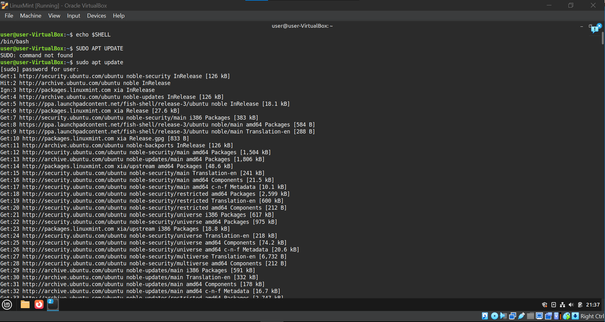

# Linux Administration Project

### Company Background
This company is a growing e-commerce support company that provides inventory and order management solutions for small retail businesses. Due to rapid growth, the company recently migrated its systems to AWS using Amazon Linux AMI servers.

### Business Challenge
The company does not have a dedicated Linux administrator. Multiple employees share server access, files are poorly organized, services stop unexpectedly, and system issues are discovered only after customers complain.

### Linux Admin Role
In this project we are acting as a Junior Linux Administrator charged with stabilising and securing the environment. Our main responsibilities are to: understand and navigate the Linux environment, organise the system and directory structure, configure user and group management, manage permissions, monitor system health, and automate basic tasks using Linux command-line tools and shell scripting.

<br>

# Execution:

### Shell environment
1. View the shell currently running:
```bash
echo $SHELL
```


2. To install fish shell, run the following commands:
```bash
$ sudo apt-add-repository ppa:fish-shell/release-3
```

```bash
$ sudo apt-get update && sudo apt-get upgrade
```

```bash
$ sudo apt-get install fish
```

```bash
Caution. This command may give a PAM error. If that is the case, use the next command instead.
$ sudo chsh -s /usr/local/bin/fish
```

```bash
$ chsh --shell /usr/bin/fish username
This sets Fish Shell as the Default Shell.
```


3. Restart the machine.

4. Open terminal

5. If fish is correctly installed you will see something like “Welcome to fish, the friendly interactive shell. Type help for instructions on how to use fish”

6. You can also check with
```bash
echo $SHELL 
```

<br>

### System discovery
The objective here is to understand the system and identify existing system info before making any changes.

1. First identify the Linux distribution
```bash
cat /etc/os-release
```

2. Identify the kernel version
```bash
uname
```
```bash
uname -a
```

3. Check the architecture
```bash
arch
```

4. Identify the current user
```bash
Whoami
```
```bash
id
```

5. Identify the server hostname
```bash
hostname
```

6. Check disk layout
```bash
lsblk
```

7. Check disk usage
```bash
df -h
```

8. Check system memory
```bash
free -m
``` 
 
<br>

### Company directory structure
Here, we are going to build the company workspace by creating the main company directory and directories for the various departments in the company

1. First, install the tree command
The tree command in Linux is a utility that displays the directory structure in a tree-like, hierarchical format, making it easy to visualize the organization of files and subdirectories.
```bash
sudo apt install tree
```

2. Identify the current directory structure of the system
```bash
tree
```

3. Identify the current directory
```bash
pwd
```

4. View directory contents
```bash
ls
```
```bash
ls -l
```

5. Create main company directory
```bash
mkdir company
```

6. Create department directories
```bash
mkdir -p company/departments/Management
```

```bash
mkdir -p company/departments/Sales
```

```bash
mkdir -p company/departments/Marketing
```
```bash
mkdir -p company/departments/IT
```
```bash
mkdir -p company/departments/Finance
```

7. Create shared and administrative directories
```bash
mkdir company/shared
```

```bash
mkdir company/scripts
```

```bash
mkdir company/logs
```

```bash
mkdir company/docs
```

8. Verify directory structure
```bash
tree
```

```bash
ls -R company
```

9. Note: The command to delete a directory: 
```bash
rm -r directory_name
```

<br>

### User and Group management

<br>

### Create groups for the various departments:

1. Create department groups
```bash
sudo groupadd Management
```

```bash
sudo groupadd Sales
```

```bash
sudo groupadd Marketing
```

```bash
sudo groupadd IT
```

```bash
sudo groupadd Finance
```

2. To verify the creation of the groups
```bash
getent group Management
```

```bash
getent group Sales
```

```bash
getent group Marketing
```

```bash
getent group IT
```

```bash
getent group Finance
```

3. Note: The command to delete a group:
```bash
sudo groupdel groupname   
```

4. Note: The command to display all groups: 
```bash
getent group
``` 

<br>

### Create user accounts for the employees in the various departments:

-m creates the user's home directory if it does not exist.
-g sets the user's primary group to the specified group.
sudo passwd sets their password.

1. Management accounts
```bash
sudo useradd -m -g Management Management_JohnDoe
```
```bash
sudo passwd Management_JohnDoe
```

```bash
sudo useradd -m -g Management Management_MaryHopkins
```
```bash
sudo passwd Management_MaryHopkins
```

```bash
sudo useradd -m -g Management Management_LukeFletcher
```
```bash
sudo passwd Management_LukeFletcher
```

2. Sales accounts
```bash
sudo useradd -m -g Sales Sales_KellyLucas
```
```bash
sudo passwd Sales_KellyLucas
```

```bash
sudo useradd -m -g Sales Sales_AndrewWright
```
```bash
sudo passwd Sales_AndrewWright
```

```bash
sudo useradd -m -g Sales Sales_KatiePost
```
```bash
sudo passwd Sales_KatiePost
```

3. Marketing accounts
```bash
sudo useradd -m -g Marketing Marketing_BernardWolfe
```
```bash
sudo passwd Marketing_BernardWolfe
```

```bash
sudo useradd -m -g Marketing Marketing_RoyceForest
```
```bash
sudo passwd Marketing_RoyceForest
```

```bash
sudo useradd -m -g Marketing Marketing_GlendaRose
```
```bash
sudo passwd Marketing_GlendaRose
```

4. IT accounts
```bash
sudo useradd -m -g IT IT_Admin
```
```bash
sudo passwd IT_Admin
```

```bash
sudo useradd -m -g IT IT_MarkDavison
```
```bash
sudo passwd IT_MarkDavison
```

```bash
sudo useradd -m -g IT IT_AnthonyJefferson
```
```bash
sudo passwd IT_AnthonyJefferson
```

```bash
sudo useradd -m -g IT IT_BenjaminFrank
```
```bash
sudo passwd IT_BenjaminFrank
```

5. Finance accounts
```bash
sudo useradd -m -g Finance Finance_EleanorDonalds
```
```bash
sudo passwd Finance_EleanorDonalds
```

```bash
sudo useradd -m -g Finance Finance_GaleAtkins
```
```bash
sudo passwd Finance_GaleAtkins
```

```bash
sudo useradd -m -g Finance Finance_WilliamSkinner
```
```bash
sudo passwd Finance_WilliamSkinner
```

6. Use the following command to verify the creation of the user accounts. For example, id Management_JohnDoe
```bash
id “userAccountName”
```

<br>

### Additional Group Access Configuration
1. Configure the IT_Admin account to have access to the other department groups.
```bash
sudo usermod -aG Management IT_Admin
```
```bash
sudo usermod -aG Sales IT_Admin
```
```bash
sudo usermod -aG Marketing IT_Admin
```
```bash
sudo usermod -aG Finance IT_Admin
```
This command adds the user IT_Admin to the management group without removing them from any existing groups. The -aG flag ensures the user is appended to the specified group(s), preserving their current group memberships.

2. Verify group membership
```bash
groups IT_Admin
```

<br>

### Directory structure
After successfully completing these steps, we should have a company directory structure like so:

<br>

### Permissions
1. Restrictions for department directories
```bash
sudo chmod 770 company/departments/Management
```
```bash
sudo chmod 770 company/departments/Sales
```
```bash
sudo chmod 770 company/departments/Marketing
```
```bash
sudo chmod 770 company/departments/IT
```
```bash
sudo chmod 770 company/departments/Finance
```
The purpose of this command is to restrict access so that only the owner and members of the group can read, write, and execute files in the specified directories. 
770 means:
Owner (user): Read (4), Write (2), Execute (1) → 4+2+1 = 7
Group: Read (4), Write (2), Execute (1) → 4+2+1 = 7
Others (everyone else): No access → 0 
So, after running these commands the owner of each directory (company/departments/Sales, /Marketing, etc.) can fully access and modify the contents. Group members can also read, write, and enter the directories. All other users cannot access, view, or modify any files or subdirectories within these directories. This is commonly used to secure department-specific folders in a shared environment where only authorized users (owner and group) should have access.

2. Shared directory access
```bash
sudo chmod 775 company/shared
```
This command changes the permissions of the company/shared directory and all its contents to allow read, write, and execute access for the owner and the group, while also granting read and execute access to others. 
775 means:
7 (owner): read (4) + write (2) + execute (1) = full access. 
7 (group): same as owner. 
5 (others): read (4) + execute (1) = can view and run files, but not modify them. 
This is commonly used for shared directories where team members (in the same group) need to edit files, while others can only view or run them.

3. Secure scripts directory
```bash
sudo chmod 750 company/scripts
```
This one allows the owner and group members of the company to navigate and run scripts in the directory, while preventing others from accessing it entirely.
Breakdown:
7 (Owner): The file owner has read (4), write (2), and execute (1) permissions. 
→ 4 + 2 + 1 = 7
5 (Group): Group members have read (4) and execute (1) permissions, but no write permission. 
→ 4 + 0 + 1 = 5
0 (Others): All other users have no permissions at all.

4. Verify permissions
```bash
ls -l company/departments
```
```bash
ls -l company
```

<br>

### System monitoring
1. Install system monitoring tool
```bash
sudo apt install htop
```
2. Monitor running processes
```bash
top
```
3. View active processes
```bash
ps aux
```
4. Check disk usage
```bash
df -h
``` 

<br>

### Logs overview
1. List log files
```bash
ls /var/log
```

<br>

### Scripting and automation


